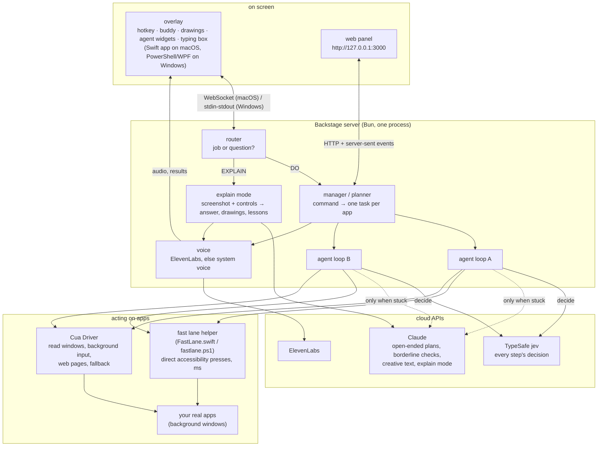

# Backstage

**Tell your computer what to do, and coloured AI agents do it inside your real apps, in background windows, while you keep working. Or ask about anything on your screen, and it answers out loud while it draws on your screen to show you.**

Each step is decided by **TypeSafe jev**, a small calibrated classifier (about 0.6 s and $0.00008 per decision), not by a large language model. An LLM (Claude) is called only where it is genuinely needed: open-ended planning, writing text, a borderline check, and explain mode's picture of the screen. When jev isn't sure, the agent stops and says why instead of guessing.

This repository holds the two engines of the same product, each tested live on its own platform:

| | **macOS** ([`mac/`](mac)) | **Windows** ([`windows/`](windows)) |
|---|---|---|
| Start | `bash start.sh` (or `bash start.sh --record` to record a demo) | `powershell -ExecutionPolicy Bypass -File start.ps1` |
| Hotkey | hold **Control + Option** to talk, tap to type | hold **Ctrl + Win** to talk, tap to type |
| Reads apps through | the macOS accessibility tree (Cua Driver) | UI Automation (Cua Driver) |
| Fast lane (actions in milliseconds, truly parallel) | direct accessibility presses and text inserts (`mac/native/FastLane.swift`) | UI Automation Invoke / Toggle / Select / Value (`windows/native/win/fastlane.ps1`) |
| Overlay (cursors, drawings, widgets) | native Swift app (`mac/overlay/Overlay.swift`) | PowerShell / WPF (`windows/native/win/overlay.ps1`) |
| Speech to text | on-device macOS speech recognition | faster-whisper, local (`windows/native/win/voice.py`) |
| Voice | ElevenLabs (falls back to the Mac voice) | ElevenLabs (falls back to the Windows voice) |
| Tests | `cd mac && bun test` (30) | `cd windows && bun test` (136 + 1 skipped) |
| Details | [mac/README.md](mac/README.md) | [windows/README.md](windows/README.md) |

Both engines share the same design (and the panel only answers this computer: it listens on 127.0.0.1 and refuses requests from other web pages): one hotkey for everything, a router that tells a job from a question, one coloured agent per part of the job, a fast lane with Cua Driver as the safe fallback, live widgets, explain mode with lessons, and the same voice. The Windows engine was built after the Mac one and follows its design, colours, router, explain mode, voice and fast lane.

## How it works

```
voice / typed ──► router ──► DO ──► dispatcher ──► agent A, agent B, agent C … (in parallel, one window each)
   (hotkey)        │                    (code in ~0 ms; jev only when no app is named)
                   └────► EXPLAIN ──► 1 screenshot + the window's controls ──► Claude (vision) ──► overlay + voice

each agent, each step (max 25):
  OBSERVE the window as text ─► PERCEIVE the 40 most relevant controls ─► DECIDE (jev, ~0.6 s)
  ─► GATE (confidence below 0.4: don't act; re-plan once, else stop and say why)
  ─► ACT (fast lane in milliseconds, or Cua ~0.6 s) ─► VERIFY ("done?" vs the starting snapshot: code first, jev, LLM only if borderline)
```

Common tasks have **skills**: plans built in code before the loop (Calculator keys, a search URL, a maps route, a file sort with an undo script, writing a Word document). Everything else goes through the general loop above.

## Architecture

Backstage is one local server (TypeScript on Bun) plus two small native helpers per platform. Nothing is hosted: the panel and the overlay talk to the server on `127.0.0.1`, and the only network calls are to the model and voice APIs.



**Processes.** `start.sh` / `start.ps1` start the server and the overlay together, and the server starts the rest on demand:

| Process | What it is | How it talks |
|---|---|---|
| Backstage server | `src/main.ts`: router, planner, agents, explain mode, voice, panel API | serves the panel and the overlay on `127.0.0.1:3000` and refuses other web pages |
| Overlay | `mac/overlay/Overlay.swift` (a menu-bar app) / `windows/native/win/overlay.ps1` | macOS: WebSocket to `/overlay`; Windows: JSON lines over stdin/stdout |
| Fast lane | `mac/native/FastLane.swift` (compiled on first start) / `windows/native/win/fastlane.ps1` | one warm process, JSON lines over stdin/stdout |
| Cua Driver | the `cua-driver` daemon by trycua | one `cua-driver call <tool> '<json>'` per action, a named session (and cursor colour) per agent |
| Speech to text | macOS speech recognition inside the overlay / `windows/native/win/voice.py` (faster-whisper) | on device; only the text reaches the server |

**A job, end to end.**
1. **In.** You hold the hotkey and speak (or tap and type). The overlay turns speech into text on the device and sends it to the server.
2. **Route.** `router.ts` decides in code whether it is a job or a question. Only unclear sentences go to jev, and an unsure answer counts as a question, because explaining never changes anything.
3. **Plan.** The manager splits the command into one task per app and gives each an agent: a name, a colour and its own Cua session. Skills compile common tasks into plans in code. jev picks the app when none is named, and Claude plans only open-ended parts.
4. **Loop.** Each agent runs the observe → perceive → decide → gate → act → verify loop shown above, in parallel with the others. Reading a window is text from the accessibility tree (UI Automation on Windows), not a screenshot.
5. **Act.** A press or a text insert on a native control goes through the fast lane, which re-finds the exact control the agent saw (same role, label and position within 3 points) before touching it. Everything else (web pages, keys, launching apps, anything the fast lane can't do safely) goes through Cua.
6. **Check and report.** A task is done only when a check agrees: code first (the Calculator display, text read back, files on disk), then jev, then Claude for borderline verdicts. Results go to the widgets and are read aloud.

**A question, end to end.** The overlay takes one screenshot the moment you press the hotkey. The server adds the front window's controls with their exact frames and asks Claude (vision) for an answer plus drawings that point at controls by id. Points are snapped to the real control under them, so rings land exactly on buttons. The overlay draws them while the voice speaks. "How do I…" becomes a lesson, and next / back / repeat are handled in code with no model call. The screenshot is deleted after the answer.

**Where each model is used.**

| Job | Done by | Model call |
|---|---|---|
| Job or question | code, then jev if unclear | rarely |
| Split a command into tasks | code; jev picks the app if none is named | rarely |
| Plan a task | skills in code, then a plan cache | Claude only for open-ended tasks or when an agent is stuck, re-planning from the current screen |
| Each step: which action, which control | **jev** (~0.6 s, ~$0.00008) | every step |
| Confidence gate | code: below 0.4, don't act | none |
| Done? | code, then jev | Claude only for borderline verdicts |
| Creative text ("write a packing list") | | Claude |
| Explain mode | | Claude (vision), once per question |

**Safety is in code, not prompts.** Whatever a model decides, the agent never types into password, card or ID fields. It never makes an irreversible click (pay, delete, send…) that you didn't ask for, and it never overwrites text it didn't write. A field is read back before Enter. File moves stay inside one folder in your home folder, never delete or overwrite, and each one writes an undo script. Each engine's README lists the full rules.

**Logs.** Every run writes `runs/<runId>/steps.jsonl` with the controls seen, jev's probabilities, the action, the timings and the cost of each step. The panel can compare jev with an LLM on the same plan (macOS) and replay a past run (Windows).

**Where to find each piece.**

| Piece | macOS | Windows |
|---|---|---|
| Server, panel API | `mac/src/server.ts`, `mac/viewer/` | `windows/src/server.ts`, `windows/viewer/` |
| Router (job or question) | `mac/src/router.ts` | `windows/src/router.ts` |
| Planner / dispatcher | `mac/src/manager.ts`, `mac/src/compile.ts` | `windows/src/planner.ts`, `windows/src/lanes.ts` |
| Agent loop | `mac/src/loop.ts` | `windows/src/agent.ts` |
| Perception (window → ranked controls) | `mac/src/perceive.ts` | `windows/src/perceive.ts` |
| Deciders (jev, Claude) | `mac/src/decide.ts`, `mac/src/jevhelper.ts`, `mac/src/llm.ts` | `windows/src/jev.ts`, `windows/src/claude.ts` |
| Driver (Cua) | `mac/src/driver.ts` | `windows/src/driver/win.ts` (`sim.ts` for tests) |
| Fast lane | `mac/src/fastlane.ts` + `mac/native/FastLane.swift` | `windows/src/fastlane.ts` + `windows/native/win/fastlane.ps1` |
| Safety rules | `mac/src/safety.ts` | `windows/src/safety.ts` |
| Explain mode | `mac/src/explain.ts` | `windows/src/explain.ts`, `windows/src/pointer.ts` |
| Voice out | `mac/src/voice.ts` | `windows/src/voice.ts`, `windows/src/speak.ts` |

Both engines implement the same `Driver` interface (`contracts.ts`), so the loop doesn't know which platform it runs on. [`mac/docs/INTEGRATION.md`](mac/docs/INTEGRATION.md) maps the macOS accessibility roles to UI Automation.

## Quick start

You need [Bun](https://bun.sh) 1.4+, [Cua Driver](https://github.com/trycua/cua/tree/main/libs/cua-driver) 0.32.0 and a TypeSafe API key. An Anthropic key (Claude) and an ElevenLabs key are optional but recommended.

```sh
cd mac            # or: cd windows
bun install
cp .env.example .env    # add TYPESAFE_API_KEY, ANTHROPIC_API_KEY, ELEVENLABS_API_KEY
cd .. && bash start.sh  # Windows: powershell -ExecutionPolicy Bypass -File start.ps1
```

Then hold the hotkey and say "compute 128 times 37 in Calculator". Each engine's README covers the platform setup: permissions on macOS, and Cua's installer and the speech model on Windows.

## What each engine does

| Feature | macOS | Windows |
|---|---|---|
| One command, several agents at once (one per app; up to 9), each with a widget and a live preview of its window | ✅ | ✅ |
| Agent cursors that fly to every action, visible in the widgets and in screen recordings | ✅ (`--record`) | widgets and rings |
| Explain mode: rings, boxes, circles, arrows, underlines, labels on the real controls; "how do I…" lessons | ✅ (Option + → / ←, Esc) | ✅ (Alt + → / ←, Esc) |
| Messaging (search the contact, the right box for the name and the text, send only when asked, only to the named chat) | ✅ (general logic, tested on WhatsApp) | ✅ |
| Calculator, web answers, Word documents, file sorting with Undo | ✅ | ✅ |
| Maps routes, stock prices, weather | Apple Maps, Stocks, Weather apps | Google Maps, Google Finance, wttr.in |
| Multi-step jobs where a later part uses an earlier result ("find X then write it in Notepad") | | ✅ |
| Several jobs at once, each with its own Stop | | ✅ |
| Never types into password, card or ID fields; no irreversible clicks (pay, delete, send…) the user did not ask for | ✅ (refuses unasked ones) | ✅ (asks for approval) |
| Flights (to the page before payment), launching games, finding folders by name | | ✅ |
| Replay a past run, compare jev with an LLM on the same plan, benchmark with independent checks | compare + benchmark | replay |

## Measured (macOS, 4 Oct 2026)

| | Backstage | An LLM doing everything |
|---|---|---|
| Per task (same 5 tasks, independent checks) | **$0.0013** | $0.029 (about 20× more) |
| Time per task (same 5 tasks) | 9.3 s | 20.7 s |
| Per decision (408 logged agent tasks) | $0.00008, 0.58 s typical, 1.2 s slowest 5% | $0.0044, 2.2 s |
| Benchmark (10 everyday tasks × 2 runs) | 20 / 20 correct, 0 wrong-but-sure | |
| Six agents at once (Calculator, Weather, Maps, Stocks, Safari, Word) | 6 / 6 in 22.8 s | |

Windows measurements are in [windows/evidence](windows/evidence).

## Repository layout

```
start.sh, start.ps1   launchers (pick the engine for this computer)
mac/                  the macOS engine (TypeScript on Bun + Swift overlay and fast lane)
windows/              the Windows engine (TypeScript on Bun + PowerShell overlay and fast lane, Python speech)
```

## Credits

**Cua Driver** by trycua (MIT), **TypeSafe jev** (`@typesafe-ai/sdk`), **Anthropic Claude**, **ElevenLabs** (text to speech; free plan attribution), **awlevin/typesafe-computer-use** (MIT; the classifier-per-step loop), **faster-whisper** (MIT), **wttr.in**.
