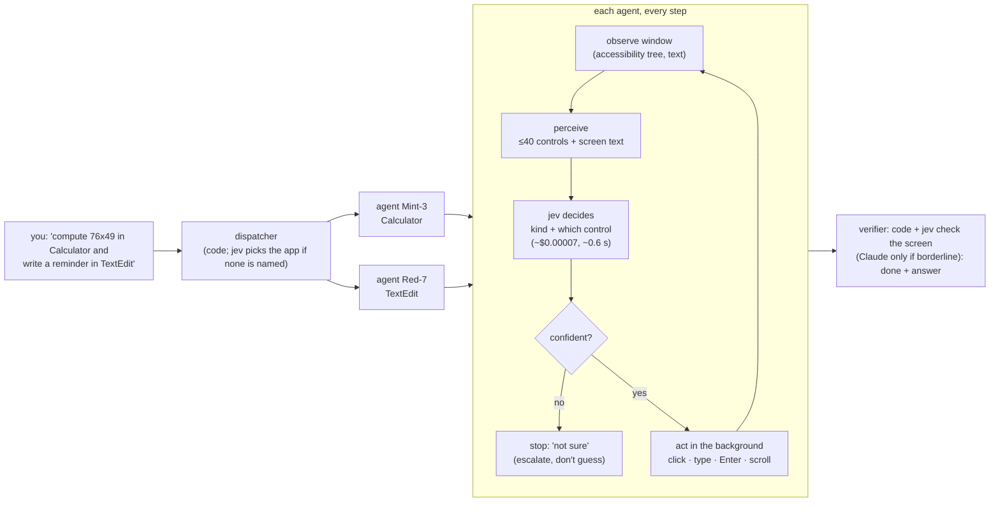

# Backstage

**Tell your Mac what to do. Coloured AI "agents" do it inside your real apps, in background windows, while you keep working, and they decide each step with a cheap classifier instead of an LLM.**

* One command can become several tasks: each gets its own **agent** (a named, coloured cursor), bound to one app window, and the agents run **in parallel**.
* The agents read windows through the macOS **accessibility tree as text**: no screenshots are sent anywhere.
* Every step is decided by **TypeSafe jev**, a calibrated classifier: about **$0.00007 and 0.6 s per decision**, against about **$0.004 and 2 s for Claude Sonnet** on the same input (measured below).
* An LLM is used **only where it's needed**: when jev is stuck, when a check is borderline, or for creative text. Every LLM call is logged with its reason.
* If jev isn't confident, the agent **stops and says so** instead of guessing.
* **One hotkey for everything.** Hold **Control + Option** and say it (or tap to type): a job ("compute 128 times 37 in Calculator") starts the agents, and a question about your screen ("how do I…?") gets an explanation drawn on the screen.

## How it works



| Piece | What | Done by (default) |
|---|---|---|
| Dispatcher | splits the command into one task per app | code; jev picks the app when none is named |
| Planner | concrete steps for the task ("click 7 → click Multiply → …") | compilers in code, then a plan cache; Claude only when jev is stuck |
| **Decision at every step** | **jev: which kind of action, which control** | **jev, ~$0.00007 per step** |
| Writer | free text for a field (only if the plan didn't give it) | Claude, only for creative text |
| Verifier | reads the window text: achieved? what's the answer? | code and jev; Claude only for borderline verdicts |
| Driver | [Cua Driver](https://github.com/trycua/cua) 0.32 (MIT): background clicks and typing, coloured session cursors | Cua, on the Mac (free) |

The **"LLM brain"** mode replaces jev with Claude Sonnet choosing every step from the same text. It exists to measure the difference honestly, and **Compare** in the panel runs both on the same plan.

## Measured on a MacBook (3 Oct 2026, macOS 26, Cua Driver 0.32.0)

| What | jev (this project) | Claude Sonnet 5.5 every step |
|---|---|---|
| Decision accuracy, 20 test decisions (Reminders-like screens) | 20/20 | n/a |
| Median time per decision | **575–672 ms** | 2,030–2,208 ms |
| Cost per decision | **~$0.00005–0.00007** | ~$0.004–0.0045 |
| Calculator "clear, then a × b" (9 decisions) | $0.00062 decisions | $0.036 decisions |
| Compare, same plan, two agents at once (Calculator + TextEdit) | 2/2 done, **30.5 s, $0.0112 total** | 2/2 done, 55.8 s, $0.0878 total |

* **Per decision, jev was ~60× cheaper (58–65× across runs) and ~3–3.5× faster.** End to end, including the one-off LLM plan and check, the two-agent run was ~8× cheaper and ~1.8× faster. The fixed LLM cost (plan, check) matters more on short tasks; the longer the task, the bigger the gap.
* Other live runs:
  * TextEdit wrote a packing list into a scratch document (2 decisions).
  * Safari read the founding year of the University of Hong Kong from Wikipedia ("1911; origins 1887").
  * Two agents at once: your front app never changed.
* Through Cua, clicks take ~0.6 s with the tuned daemon (2.4 s with Cua's defaults), and Cua runs one action at a time across all agents. The **fast lane** (below) removes both limits for clicks and native text fields.

## The fast lane: clicks and typing straight through accessibility, Cua for the rest

Cua Driver puts every action through one input lane in its daemon: ~0.6 s per click, and two apps at the same time take as long as one after the other (measured: ×1.02). The same accessibility press sent directly takes **2–4 ms**, and two apps really are worked at the same time.

So clicks and text inserts in native app windows go through a small native helper (`native/FastLane.swift`, built automatically on first start), using the element the agent just read: it re-finds it by role, label and frame (within 3 points) and only then presses it or inserts the text. Everything else stays with Cua: reading windows, typing into web pages, keys, pixel clicks, launching apps, the foreground fallback, and **any action the fast lane can't do safely**:

* text is never inserted inside a web page (the page wouldn't notice the change), and only counts as done if the field's value really changed;
* an element that isn't exactly where the agent saw it, or that refuses the press, goes to Cua (logged as `[fast lane] … → Cua (reason)`).

Every press flashes a ring in the agent's colour where it happened (fast-lane actions have no Cua cursor). `FAST_INPUT=off` turns the fast lane off. It needs the Accessibility permission for the app that runs Backstage (your terminal); without it, everything goes through Cua.

| Measured, same prompts (3 Oct 2026) | Cua only | fast lane |
|---|---|---|
| One click | 630 ms | 4–42 ms |
| Typing a line into TextEdit | 1,015 ms | 43 ms |
| "Clear the calculator and compute 128 times 37" | 12.1 s | **6.9 s** |
| Three agents at once (Calculator + TextEdit + Safari, prompt 11) | 15.4 s | **8.4 s** |

The remaining time per step is mostly reading the window (~0.15–0.4 s) and jev's decision (~0.6 s).

Every run is logged as JSON lines in `runs/<runId>/steps.jsonl`: the controls seen, the probabilities, the action, the timings and the cost.

## LLM only where it's needed (`HELPER=jev`, the default)

jev does everything it can. The LLM is called **only when jev needs it**, and every call is logged with the reason.

| Job | How it's done | When the LLM is used |
|---|---|---|
| Split the command into tasks | Code splits the sentence; the app is the one named, a browser for web words, else **jev picks the app** | never |
| Plan | **Compilers in code** (arithmetic → Calculator keys, look-ups → search URL, "write '…'", "titled 'X' with a, b, c", folder sorting), then a **plan cache**; otherwise **jev starts alone** | only when jev is **stuck**: unsure (below the gate), stalled, or the result isn't there. The LLM re-plans **from the current screen**, at most twice per task |
| Check "done" | Something must be **new** on screen and jev (yes/no) must agree; for questions, **jev picks the answering line**; computations must show a **new number**; folders are checked on disk | only for **borderline** verdicts (jev 35–85% sure, or unsure which line answers) |
| Free text | The user's own text | only for genuinely **creative** text ("write a packing list") |

A plan the LLM made is **cached** after a verified success in which the agent actually acted, so the same task needs no LLM next time. Measured: "add 250 and 175, then subtract 80" used the LLM once ($0.0038), then **none** on the rerun ($0.0009).

**Benchmark** (`bun run src/bench.ts --all`): 10 tasks, each with an **independent** correctness check, starting from an empty plan cache.
* 6 of the tasks have compilers: ×, %, Wikipedia, web search, TextEdit, Finder.
* 4 have none: play a YouTube video, a creative packing list, the square of 17, and a chain of arithmetic.

| Helper | Correct | False "done" | LLM calls | Time | Cost |
|---|---|---|---|---|---|
| Claude Haiku for every task (before) | 10/10 | 0 | 19 | 166 s | $0.0699 |
| **jev first, LLM only when needed (now)** | **10/10** | **0** | **3** | **121 s** | **$0.0105** |

The benchmark's earlier runs found and fixed false "done"s:
* a split answer line;
* an old result left on screen;
* a poisoned plan cache;
* an expression without its result ("250+175-80").

The fix for each was to call the LLM *in that situation*, not everywhere. `LLM_FALLBACK=off` runs with no LLM at all (weaker on creative and unfamiliar tasks); `HELPER=haiku` restores the old behaviour.

## The hotkey: one way in, for the agents and for explain mode

Hold **Control + Option** and talk, or tap it and type. The server decides what you meant:

* **A job** (it starts with an action, "open", "compute", "write", "find", "organise", "play"…, or names an app as the place: "in Calculator") **starts the agents**. Backstage says "On it.", a **widget for each agent** appears in the bottom-right corner (its colour, its app, what it is doing right now, a running clock), and when they finish it reads the results out ("In Calculator: 45 times 12 is 540. TextEdit is done. In Safari: …") and shows them on the widgets. Say **stop** to stop them (or use the menu-bar icon).
* **A question about the screen** ("how do I…", "what does this do", "where is…", "underline…") goes to explain mode, below.
* Clear cases are decided by code in 0 ms (`src/router.ts`). Only an unclear one goes to jev (about 0.5 s), and when jev isn't sure it's treated as a question: explaining never changes anything, acting does.

Each widget also shows a **live preview of the window its agent is working in** (about once a second, even when that window is covered by others), in a grid that grows to 2 or 3 columns for 4–9 agents. The previews use ScreenCaptureKit and need **Screen Recording** for Backstage Overlay (macOS asks the first time; until then the widget says so). The menu-bar icon can turn previews off.

The widgets never take clicks and are never in screenshots. Results stay for 15 seconds, then the widgets fade. Runs started from the web panel get widgets too.

## Explain mode: it sees your screen when you ask, and draws on it

Hold **Control + Option** and ask out loud, or **tap** it to type. Backstage looks at your screen, answers out loud, and draws on top of your screen to show what it means: a **ring** around a button, an **underline** under a sentence, a **circle**, an **arrow**, a short **label**. A small buddy next to your cursor shows *listening… / thinking… / the answer* and flies to the thing it's talking about. Drawings fade after a few seconds.

* **Lessons.** Ask "how do I…?" and you get one step at a time, each with its own drawing. Say or type **next**, **repeat**, **back** or **stop**, or use the keys: **Option + →** next step, **Option + ←** previous step (while a lesson is on screen, so Option + arrow doesn't jump words in text fields then). These are handled in code, with no LLM call.
* **Quiet, now.** Press **Esc** while Backstage is talking and it stops (the drawings stay); press **Esc** again within 2 seconds to clear them. These keys are global hotkeys that need no permission and exist only while they mean something (Esc while it's talking, the arrows while a lesson is on screen), so the rest of the time they belong to your apps.
* **It sees only when you ask.** One screenshot of the main display is taken the moment you press the hotkey, plus the accessibility tree of the window in front. The screenshot is deleted after the answer, and `runs/explain-journal.jsonl` keeps only the text. Speech recognition runs on the Mac.
* **Exact pointing.** The model gets the front window's controls with their exact frames (from the accessibility tree) and points at them by id. A point it gives on the picture is snapped to the control under it, and an underline is snapped to the actual lines of text. Measured: rings land exactly on Calculator keys and Google's tabs.
* **Spoken answers** use a natural ElevenLabs voice (Alice) when `ELEVENLABS_API_KEY` is in `.env`, and the Mac's own voice otherwise. The server fetches the audio, so the key never reaches the overlay. The first sentence is fetched on its own, so speech starts about 0.5–0.9 s after the drawing; the next lesson step is fetched while you listen, so **next**, **repeat** and **back** start instantly and cost nothing. English uses `eleven_flash_v2_5`; Chinese uses `eleven_v4_turbo` (Cantonese when the text is Cantonese). Any failure falls back to the Mac voice for that sentence, and ElevenLabs is switched off before the monthly quota runs out. Set `ELEVENLABS_VOICE=<voice id>` for another voice, or `VOICE=apple` to use only the Mac voice.
* **Cost of the voice.** Half a credit per character. The free plan gives 10,000 credits a month: a 6-step lesson used about 400.
* The overlay's own windows are kept out of screenshots, and they never take clicks.

| | Sonnet 5.5 (default) | Haiku 4.5 (`EXPLAIN_MODEL=claude-haiku-4-5-20251001`) |
|---|---|---|
| time to answer (measured) | 3–9 s | 2–5 s |
| cost per question | ~$0.015–0.02 | ~$0.006–0.008 |
| 6-step Calculator lesson | every ring correct | one wrong key ringed ("2" for "5") |

Setup: `bash scripts/build-overlay.sh` once (a native Swift menu-bar app, no dependencies). `bun run start` then starts it as well. The first time you hold the hotkey, macOS asks for Microphone and Speech Recognition permission. Tapping to type needs no permission.

## Run it

Requirements:
* macOS 14+ and [Bun](https://bun.sh) 1.4+.
* [Cua Driver](https://github.com/trycua/cua/tree/main/libs/cua-driver) **0.32.0**, with Accessibility and Screen Recording granted to `CuaDriver.app`.
* A TypeSafe API key (console.typesafe.ai).
* An Anthropic API key (optional for jobs, where Claude is only the fallback; needed for explain mode and the LLM comparison).

```sh
bun install
cp .env.example .env          # TYPESAFE_API_KEY=...  ANTHROPIC_API_KEY=...
bash scripts/daemon.sh        # restart the Cua daemon, tuned (also needed once after granting permissions)
bash scripts/make-signing-identity.sh   # once per Mac: the overlay keeps its permissions across rebuilds
bun run start                 # panel on http://127.0.0.1:3000 AND the overlay, together (Ctrl+C stops both)
bun run record                # the same, for recording a demo video: the overlay shows up in screen recordings
```

Or from a terminal:

```sh
bun run src/cli.ts "Clear the calculator and compute 128 times 37 in Calculator"
bun run src/cli.ts "In TextEdit, write a three item packing list for a weekend hiking trip"
bun run src/cli.ts "In Safari, look up the University of Hong Kong on Wikipedia and tell me the year it was founded"
bun run src/cli.ts "... same command ..." --brain llm      # the LLM brain, for comparison
```

**Keep the target apps on your current desktop.** macOS hides windows on another Space, or behind a full-screen app, from accessibility.

## Tests

```sh
bun test            # engine tests on a simulated Calculator: plan → verified answer, low-confidence stop, wrong result refused, …
bun run typecheck
```

## Finder: organising folders

macOS refuses background drags (Cua: `background_unavailable`, measured), so a background agent cannot move files through Finder's GUI. Folder tasks therefore work like this:

* The agent opens the folder in Finder. The planner picks the target folders.
* **jev decides, file by file, which folder each file goes into**: one cheap, calibrated decision per file. Files it isn't sure about are **left in place, with the reason**.
* The moves are file-system calls, **marked "scripted" in the log and the panel**. Rules:
  * confined to that one folder (inside your home folder, never hidden or system folders);
  * never delete, never overwrite;
  * every move is written to `runs/<run>/undo-<task>.sh`.
* Done is checked against the file system itself, not by an LLM reading the screen.

Measured on a 10-file sandbox:
* "by type": 10/10 sorted, 13.5 s, 10 jev decisions for **$0.00025**.
* "into School, Money and Hackathon": 7 placed and 3 left in place with reasons (e.g. "todo.txt: unsure, confidence 0.26"), $0.00024.

## Safety and robustness rules (in code, not prompts)

* **Never edits your existing content.**
  * An agent refuses to type into a text area that already holds text it didn't write. It creates a new note or document instead, unless your command explicitly says edit, append or reply.
  * TextEdit tasks always get a fresh scratch document.
* **Read-back before Enter.** A field must hold exactly what was typed before anything is sent. If it doesn't, the agent clears the field and retypes once, and otherwise stops without sending.
* **Old results don't count.**
  * For tasks that do something, the verifier compares the screen with a snapshot taken when the task started, so a result left over from an earlier run is not accepted as success.
  * Lookup questions ("tell me…") may use what is already on screen.
* **Background first, foreground only as a counted fallback.**
  * Some apps refuse background typing, such as Electron text fields like the Claude app, or apps with several windows.
  * Then the agent retries once with a brief foreground step, and the panel shows "⚠ N foreground steps" on that agent.
  * Disable it with `allowForeground: false`.
* **Slow apps.** If reading a window runs out of time (for example Notes with hundreds of notes), the agent re-reads only the top levels of the window. That took 3.8 s on Notes, against more than 10 s for a full read.
* **Websites open without the keyboard.** The planner uses an `open_url` step instead of typing into the address bar.

## Limits (honest list)

* **macOS only.** Apps must expose accessibility labels. Native apps and web pages do; canvas apps, games and some Electron apps don't.
* **No keyboard shortcuts in the background.** macOS/Cua refuse Cmd-key combinations to background apps. Enter is sent through accessibility (`AXConfirm`) where possible.
* An app with **two or more windows** may refuse background key presses; clicks and typing still work.
* **Pop-ups, date pickers and menus** are separate windows that the agent can't see yet (for example, Reminders' due-date picker).
* jev decides well when the step is clear (a plan step to ground). Without a plan, multi-step sequences such as typing digits one by one confuse it, which is why the LLM plans once.
* The verifier is an LLM reading the window text. It is strict, but it is not a mathematical proof.
* TextEdit tasks write into a fresh scratch document in `scratch/`, never into your files.

## Layout

* `overlay/Overlay.swift`: the overlay (hotkey, buddy, drawings, voice, agent widgets); `src/router.ts`: job or question; `src/explain.ts`: capture, Claude vision, snapping to exact frames, lessons; `src/voice.ts`: ElevenLabs voice; `src/results.ts`: agents' answers for widgets and voice

```
src/manager.ts    dispatcher (command → tasks) and the agent manager (one coloured agent per app, in parallel)
src/loop.ts       one agent, one task: observe → perceive → decide → gate → act → verify
src/decide.ts     JevBrain (TypeSafe), LlmBrain (Claude, for comparison), ClaudeHelper (plan / write / verify)
src/perceive.ts   accessibility elements → ≤40 ranked controls + the text on screen
src/apps.ts       find the app, open its window in the background (scratch documents for TextEdit)
src/driver.ts     `cua-driver call <tool> '<json>'`, one subprocess per call; revives idle sessions
src/llm.ts        Claude calls with structured output and cost accounting
src/server.ts     live panel API + server-sent events;  viewer/index.html  the panel
src/cli.ts        run a command from the terminal
tests/            engine tests on a simulated Calculator
```

## Integrating with the Windows version

See [`docs/INTEGRATION.md`](docs/INTEGRATION.md). It says which modules are portable, gives the one `Driver` interface a Windows driver must implement, and maps UI Automation roles to the roles the engine uses.

## Credits

* **awlevin/typesafe-computer-use** (MIT): the clicker-loop design.
* **Cua Driver**, trycua (MIT): background input and session cursors on macOS.
* **TypeSafe jev**: the classifier.
* **Claude** (Anthropic): planner, writer, verifier and the comparison brain.
* **ElevenLabs**: the spoken voice in explain mode (free plan, which requires this credit).

